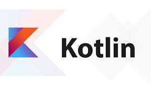

## Main scientific programming languages

Usually scientists write computational code in C++, and then turn it into Python code. This approach is outdated: it is very difficult to maintain a large code base in Python, and here the size of projects grows on the side of code users - scientists. That is why such systems are falling apart, and for the last five years engineers and scientists have been looking for more flexible and simpler alternatives.

## Other scientific programming languages

In addition to Python, various fields of science write or have tried to write in other languages.

R. It is used in statistics. It's a highly specialized language that's great for statistical problems. But often we not only need to get the data but we need to make a web service so that the user has access to this data. Writing it in R is not an easy task.

Julia. It's a pretty interesting language with a lot of design features. Try it if you lack the speed or flexibility of Python. Although Julia has a drawback too: its toolkit is still unstable.

Swift. They tried to make a universal language out of Swift too, but it never got beyond iOS. And then Kotlin came along, which strongly resembles Swift in syntax, but is suitable for a wider range of tasks and allows you to work with libraries from Java, JavaScript and C.

Java. Java is a cool language that is often unfairly berated. It was created for Enterprise, so there's an overextended "ceremony" there: you have to write a lot of extra code to build a simple application. Yes, this simplifies support and improves stability of the application, but it makes the programming process much more complicated.

Kotlin. Kotlin has all the advantages of Java but relieves the programmer of a good half of the "ceremonies", and therefore has great promise.

