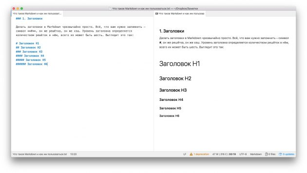
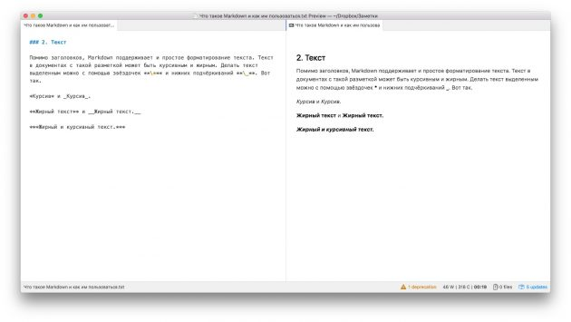

## What is Markdown?

Markdown is a text markup language created by writer and blogger John Gruber. It is designed to create beautifully formatted text in ordinary TXT files. You don't need a cumbersome word processor like Word or Pages to create documents with bold or italic type, quotes, links, and even tables. All you need to do is memorize the simple rules of Markdown and you can even write in Notepad. Using a dedicated Markdown editor is a great advantage, of course.

## Markdown advantages

- Universality

Documents written using the Markdown syntax are plain TXT files. They can be opened on any platform and in any editor. This makes them different from text processor files. Ever tried opening an Apple Pages document in Word?

- Simplicity

Markdown is so easy that even people who haven't heard of Latex and HTML can learn it in 10 minutes. Grids for subheadings, asterisks for highlighting, dashes for lists. It couldn't be easier.

- Large selection of tools

There are many, many editors for working with Markdown documents. There are online, mobile, and desktop tools. There's the monster Atom, the beautiful and minimalistic ghostwriter and iA Writer, Vim for geeks and Ulysses for professional writers. Take your pick.

- Convertibility

Markdown documents can be easily exported in any format such as PDF, DOC and ODT. The formatting is always the same.

## Disadvantages of Markdown

- Limited formatting

Because Markdown documents are just text files, you can't use fonts to beautify them. It is, after all, more of a drafting tool than a full-fledged typesetting tool.

- Strict rules

Markdown defines text as appearing in special characters. One extra * or #, and the formatting changes. So you have to be careful when you type in Markdown.

## Basic syntax

- Markdown texts are formed using special characters either before or after words and phrases. The following are the most basic rules which will work in all Markdown authors.

- Headings

Headings in Markdown are incredibly easy to use. All you need to remember is the #, aka hash, symbol. The header level is determined by the number of grids in it, and there can be six in total. It looks like this:

'## Header H1'.
## Header H2'.
'### Header H3'.
'#### Header H4'
'##### Header H5'
'###### Header H6'

- Text 

In addition to headings, Markdown also supports simple text formatting. It can be italicized or bolded with asterisks and underscores:

* Italic* and _Cursive
**Bold text** and _Bold text
***Bold and italic text***

- Quotes.

Sometimes a paragraph needs to be highlighted as a quote. In this case, use the > sign. It must be placed before each line of the quote.

**Bold text** and _Bold text
**Bold text** and _Bold text
***Bold and italic text***

- Quotes.

Sometimes a paragraph needs to be highlighted as a quote. In this case, use the > sign. It must be placed before each line of the quote.

> A very profound quote. Please read it carefully.
>
> Oscar Wilde...
