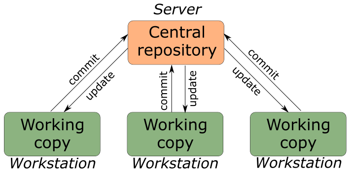

## What is a version control system?

Version Control System (VCS) is a software that allows you to track changes in documents, if necessary, roll them back, determine who and when made corrections, etc. The article discusses the types of VCS, the principles of their work, as well as examples of software products. Version control systems can be divided into two groups: distributed and centralized.

## Centralized version control systems

Centralized version control systems are client-server applications when the project repository exists in a single instance and is stored on the server. Access to it was carried out through a special client application. Examples of such software products include CVS, Subversion.

## Distributed version control systems

Distributed Version Control Systems (DVCS) allow each developer working with the system to keep a copy of the repository. In this case it is possible to allocate a central repository (conventionally), to which changes from local repositories will be sent, and with it, these local repositories will be synchronized. With such a system, users periodically synchronize their local repositories with the central repository, and work directly with their local copy. Once enough changes have been made to the local copy, they (the changes) are sent to the server. The server is usually chosen conventionally since in most DVCS there is no such a thing as a "dedicated server with central repository". The big advantage of this approach is developer autonomy when working on the project, the flexibility of the overall system and increased reliability due to the fact that each developer has a local copy of the central repository. Two of the best known DVCSs are Git and Mercurial.

Git is a distributed version control system developed by Linus Torvalds to work on the Linux operating system kernel. Major projects that use git include the Linux kernel, Qt, and Android. Git is free and distributed under the GNU GPL 2 license and, like Mercurial, is available on almost all operating systems. Its basic features are similar to Mercurial (and other DVCS), but thanks to some advantages (high speed, ability to integrate with other VCS, user-friendly interface) and a very active community that has been formed around the system, git became a leader in distributed version control systems. It should be noted that despite the great popularity of systems like git, large corporations like Google use their own VCS.

