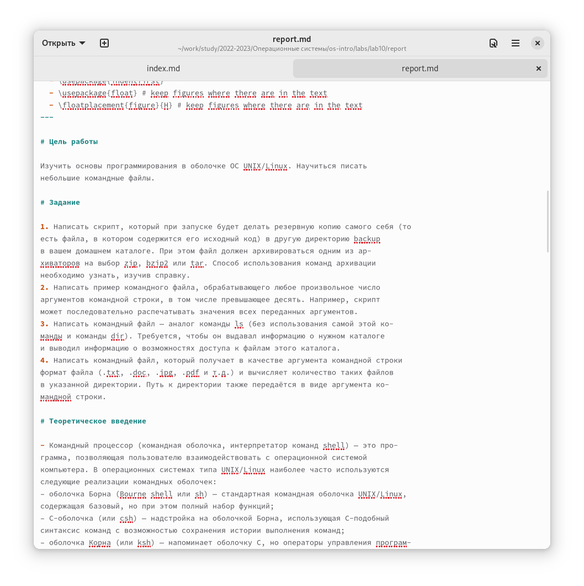

## How to make a cover page

The title page should state what type of work you are doing and what stage. You should also indicate the discipline in which you are doing the work. At the very end, include your name as the author of the work.

## Purpose of the paper, the assignment, and a theoretical introduction

After the title page, you need to provide all the necessary information about the work. A separate paragraph should specify the purpose of the work. It is also necessary to specify the tasks that will be performed on the course of the work. After all that you need to provide theoretical material that will be needed to understand the work.

## Performing the lab work.

At this point, you should describe all of the steps of completing the lab work. Describe how you performed this or that task and provide screenshots (pictures/photos). In the text you must specify the links to the screenshots, and the screenshots must be signed.

## Conclusion.

At the end you should make a conclusion about the work done. It should say what was done, what results were obtained and what new things were learned.
