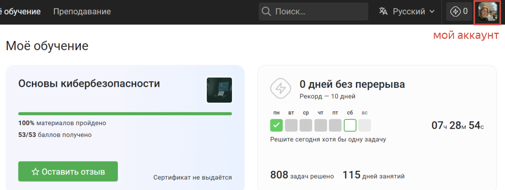
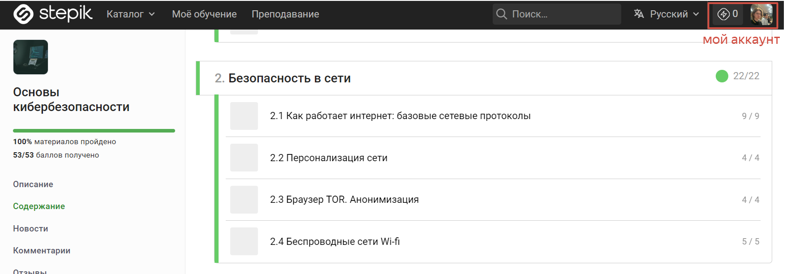
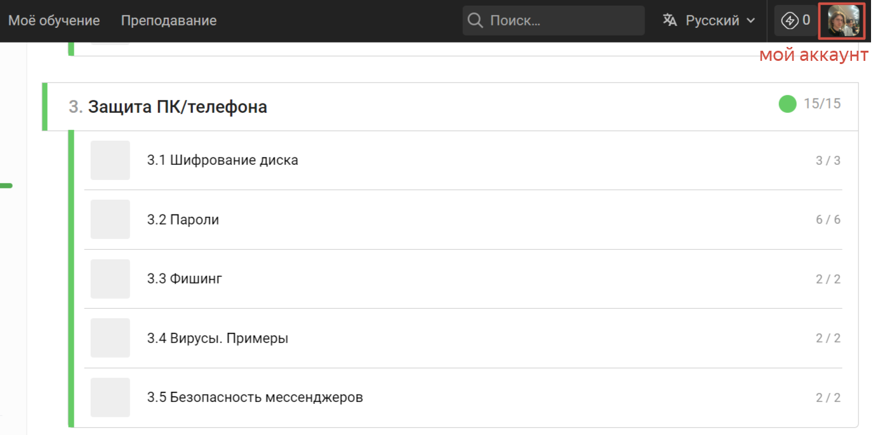
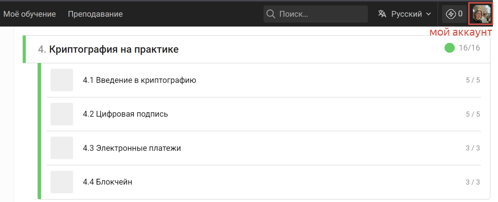

Здесь я хочу рассказать о том, как проходил внешний курс "Основы кибербезопасности" на Stepic. Содержание курса было следующим. Глава 1 - Безрпасность в сети. Глава 2 - Защита ПК/Телефона. Глава 3 - Криптография на практике. По мере прозождения я слушал видеолекции и решал тестовые задачи. В итоге я прошел курс на 100% и вынес из него много новой информации. Это позволит мне понимать более сложные темы в сфере кибербезопасности и двигаться в ней дальше.

