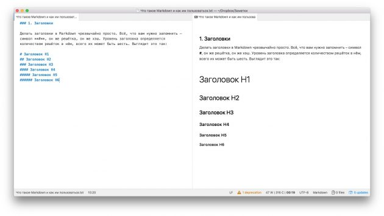
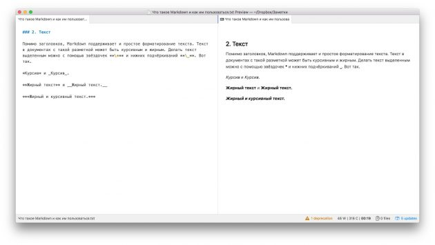

## Что такое Markdown?

Markdown — язык текстовой разметки, созданный писателем и блогером Джоном Грубером. Он предназначен для создания красиво оформленных текстов в обычных файлах формата TXT. Вам не нужны громоздкие процессоры вроде Word или Pages, чтобы создавать документы с жирным или курсивным начертанием, цитатами, ссылками и даже таблицами. Достаточно запомнить простые правила Markdown, и можно писать хоть в «Блокноте». Хотя специализированные Markdown-редакторы, конечно, намного удобнее.

## Преимущества Markdown

- Универсальность

Документы, написанные с использованием синтаксиса Markdown, представляют собой обычные текстовые файлы TXT. Их можно открыть на любой платформе и в любом редакторе. Этим они выгодно отличаются от файлов, созданных в текстовых процессорах. Пробовали открыть документ из Apple Pages в Word?

- Простота

Markdown настолько прост, что его за 10 минут смогут освоить даже те, кто до этого не слышал про все эти ваши Latex и HTML. Решётки для подзаголовков, звёздочки для выделения, тире для списков. Проще быть не может.

- Большой выбор инструментов

Редакторов для работы с документами Markdown очень, очень много. Есть и онлайновые, и мобильные, и настольные инструменты. Есть монструозный Atom, красивые и минималистичные ghostwriter и iA Writer, Vim для гиков и Ulysses для профессиональных писателей. Выбирай не хочу.

- Конвертируемость

Документы Markdown легко экспортировать в любые форматы: PDF, DOC, ODT. При этом их форматирование остаётся неизменным.

## Недостатки Markdown

- Ограниченность форматирования

Так как документы Markdown представляют собой просто текстовые файлы, красивых шрифтов в них не применишь. Всё-таки это скорее инструмент для написания черновиков, чем для полноценной вёрстки.

- Строгие правила

В Markdown текст оформляется посредством служебных символов. Один лишний знак * или #, и форматирование изменится. Так что при наборе текстов в Markdown придётся быть внимательным.

## Базовый синтаксис

- Тексты в Markdown оформляются посредством специальных символов, вставляемых перед или после слов и фраз. Вот самые простые правила, которые работают во всех редакторах.

- Заголовки

Делать заголовки в Markdown чрезвычайно просто. Всё, что вам нужно запомнить, — символ #, он же решётка, он же хеш. Уровень заголовка определяется количеством решёток в нём, всего их может быть шесть. Выглядит это так:

'# Заголовок H1'
'## Заголовок H2'
'### Заголовок H3'
'#### Заголовок H4'
'##### Заголовок H5'
'###### Заголовок H6'

- Текст 

Помимо заголовков, Markdown поддерживает и простое форматирование текста. Его можно сделать курсивным или жирным при помощи звёздочек и подчёркиваний:

*Курсив* и _Курсив_
**Жирный текст** и __Жирный текст__
***Жирный и курсивный текст***

- Цитаты

Иногда какой-то абзац нужно выделить как цитату. В этом случае воспользуйтесь знаком >. Его необходимо проставлять перед каждой строчкой цитаты.

> Очень глубокомысленная цитата. Пожалуйста, прочтите её внимательно.
>
> Оскар Уайльд
