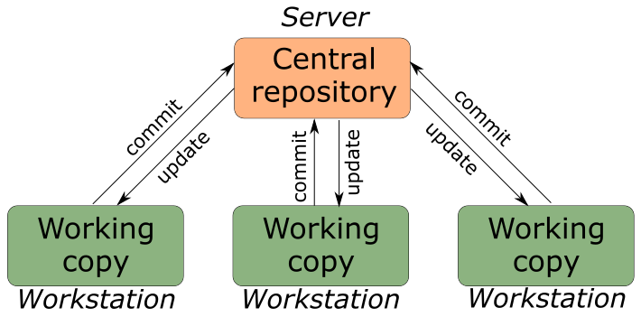

## Что такое система контроля версий?

Система контроля версий (Version Control System, VCS) представляет собой программное обеспечение, которое позволяет отслеживать изменения в документах, при необходимости производить их откат, определять, кто и когда внес исправления и т.п. В статье рассмотрены виды VCS, принципы их работы, а также приведены примеры программных продуктов. Системы контроля версий можно разделить на две группы: распределенные и централизованные.

## Централизованные системы контроля версий

Централизованные системы контроля версий представляют собой приложения типа клиент-сервер, когда репозиторий проекта существует в единственном экземпляре и хранится на сервере. Доступ к нему осуществлялся через специальное клиентское приложение. В качестве примеров таких программных продуктов можно привести CVS, Subversion.

## Распределенные системы контроля версий

Распределенные системы контроля версий (Distributed Version Control System, DVCS) позволяют хранить репозиторий (его копию) у каждого разработчика, работающего с данной системой. При этом можно выделить центральный репозиторий (условно), в который будут отправляться изменения из локальных и, с ним же эти локальные репозитории будут синхронизироваться. При работе с такой системой, пользователи периодически синхронизируют свои локальные репозитории с центральным и работают непосредственно со своей локальной копией. После внесения достаточного количества изменений в локальную копию они (изменения) отправляются на сервер. При этом сервер, чаще всего, выбирается условно, т.к. в большинстве DVCS нет такого понятия как “выделенный сервер с центральным репозиторием”. Большое преимущество такого подхода заключается в автономии разработчика при работе над проектом, гибкости общей системы и повышение надежности, благодаря тому, что каждый разработчик имеет локальную копию центрального репозитория. Две наиболее известные DVCS – это Git и Mercurial.

Git – распределенная система контроля версий, разработанная Линусом Торвальдсем для работы над ядром операционной системы Linux. Среди крупных проектов, в рамках которых используется git, можно выделить ядро Linux, Qt, Android. Git свободен и распространяется под лицензией GNU GPL 2 и, также как Mercurial, доступен практически на всех операционных системах. По своим базовым возможностям git схож с Mercurial (и другими DVCS), но благодаря ряду достоинств (высокая скорость работы, возможность интеграции с другими VCS, удобный интерфейс) и очень активному сообществу, сформировавшемуся вокруг этой системы, git вышел в лидеры рынка распределенных систем контроля версий. Необходимо отметить, что несмотря на большую популярность таких систем как git, крупные корпорации, подобные Google, используют свои VCS.

