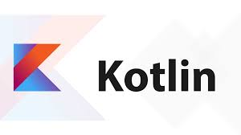

## Основные языки научного программирования

Обычно ученые пишут вычислительный код на C++, а потом оборачивают его в код на Python. Этот подход себя изживает: на Python очень сложно поддерживать большую кодовую базу, а тут размеры проектов растут именно на стороне пользователей кода — учёных. Поэтому такие системы потихоньку рассыпаются и последние пять лет инженеры и учёные ищут более гибкие и простые альтернативы.

## Другие языки научного программирования

Кроме Python в разных областях науки пишут или пытались писать на других языках.

R. Его используют в статистике. Это узкоспециализированный язык, который отлично подходит для решения статистических задач. Но часто нам надо не только получить данные, но и сделать веб-сервис, чтобы пользователь имел доступ к этим данным. Написать его на R — дело непростое.

Julia. Это довольно интересный язык со множеством конструктивных особенностей. Попробуйте его, если вам не хватает скорости или гибкости в Python. Хотя и у Julia есть недостаток: его набор инструментов всё ещё нестабильный.

Swift. Из Swift тоже пытались сделать универсальный язык, но он так и не вышел за рамки iOS. А потом появился Kotlin, который по синтаксису сильно напоминает Swift, но при этом подходит для решения более широкого спектра задач и позволяет работать с библиотеками из Java, JavaScript и C.

Java. Java — это классный язык, который часто несправедливо ругают. Его создавали для энтерпрайза, поэтому там чересчур затянутая «церемония»: чтобы собрать простое приложение, надо написать много дополнительного кода. Да, это упрощает поддержку и повышает стабильность приложения, но сильно усложняет сам процесс программирования.

Kotlin. Kotlin обладает достоинствами Java, но избавляет программиста от доброй половины «церемоний», и потому у него большие перспективы.

