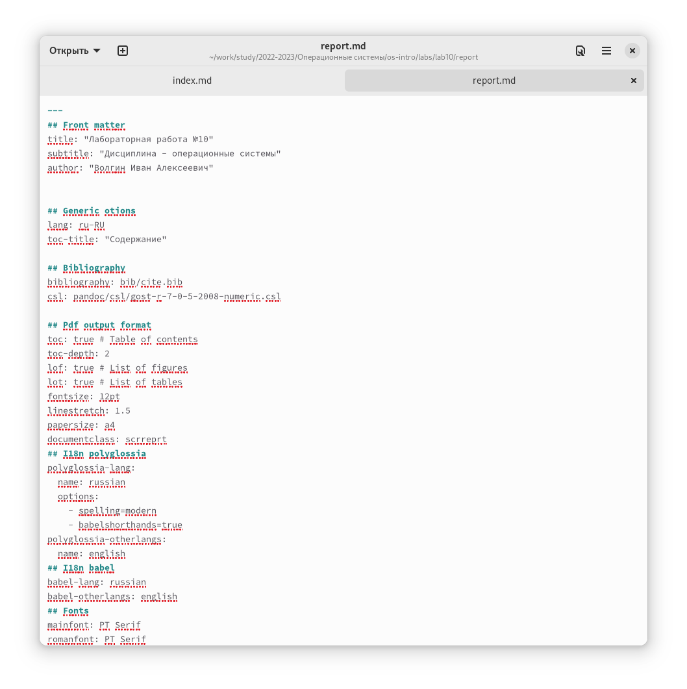
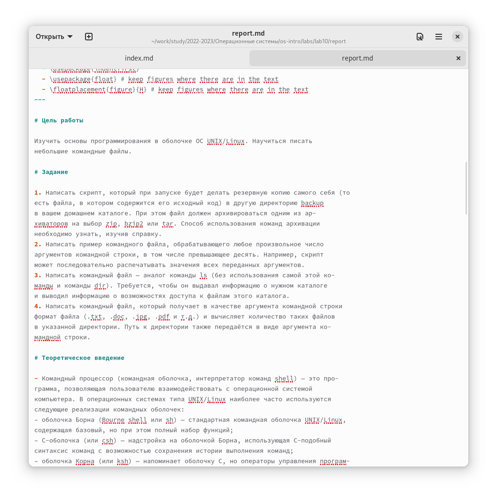

## Как оформить титульный лист

На титульном листе должно быть указано, какой тип работы вы выполняете и какой этап. Также нужно указать дисциплину, по которой вы делает работу. В самом конце указываете свое имя, как автора работы.

## Цель работы, задание, и теоретическое введение

После оформления титульного листа нужно предоставить всю необходимую информацию о работе. Отдельным пунктом нужно указать цель работы. Так же нужно указать задания, которые будут выполнены по ходу работы. После всего этого нужно предоставить теоретический материал, который понадобится для понимания работы.

## Выполнение лабораторной работы

На этом этапе нужно описывать все шаги выполнения лабораторной работы. Рассказываете, как выполнили ту или иную задачу и предоставляете скриншоты (рисунки/фотографии). В тексте обязательно нужно указать ссылки на скриншоты, а сами скриншоты нужно подписать.

## Вывод

В конце обязательно нужно сделать вывод по проделанной работе. Надо сказать, что было проделано, какие результаты получились и что нового удалось узнать.
